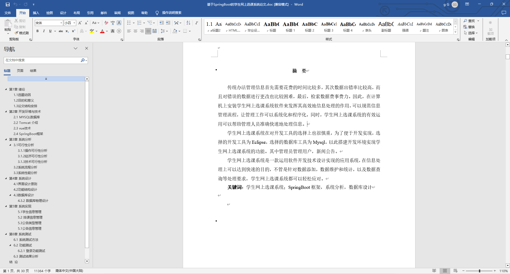
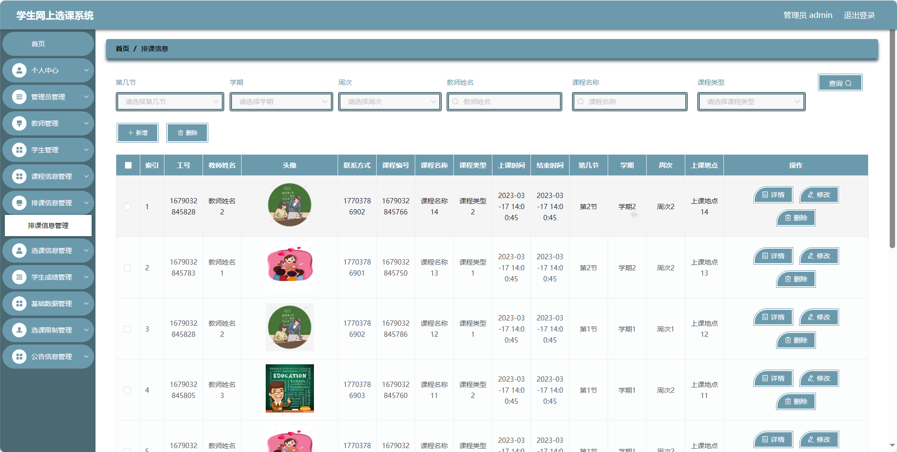
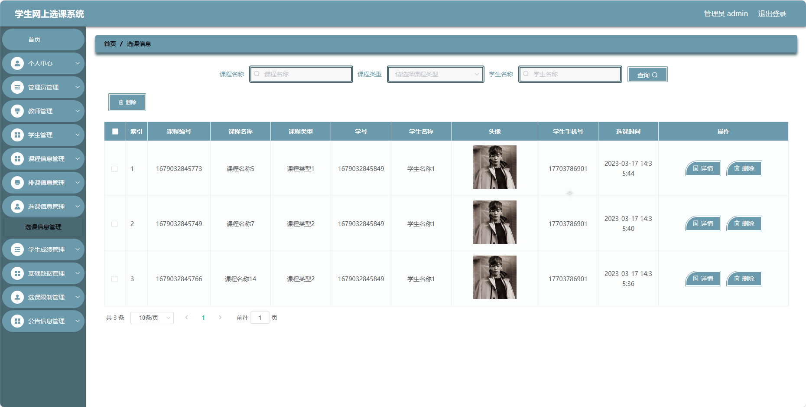
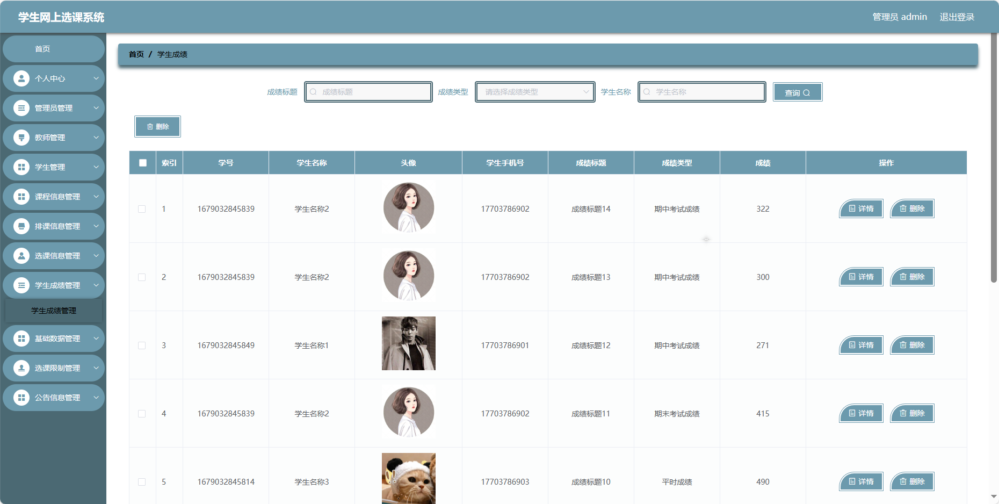
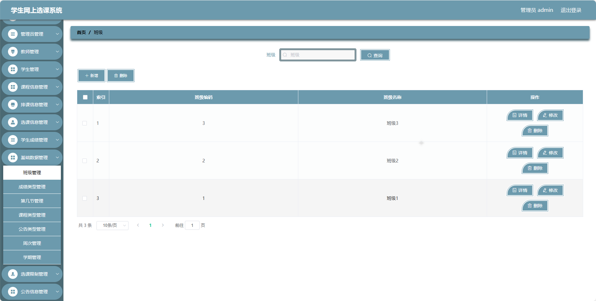
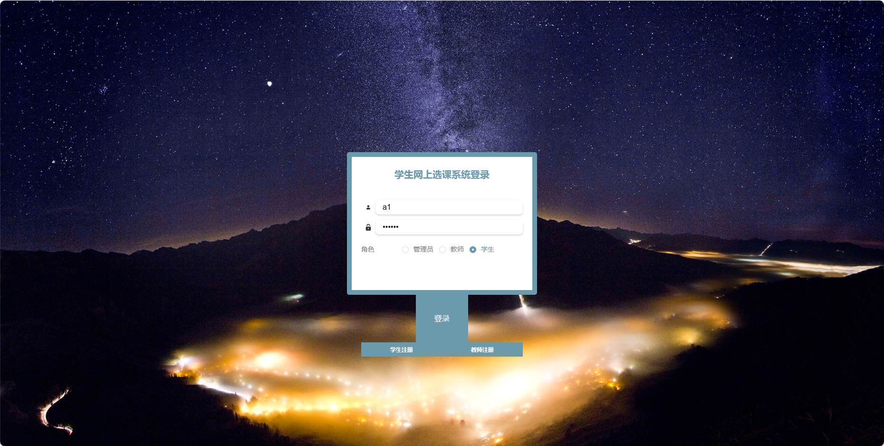
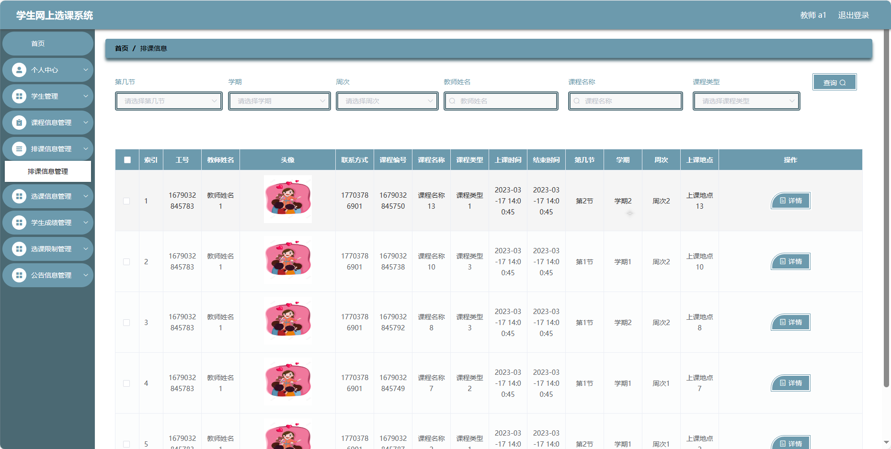
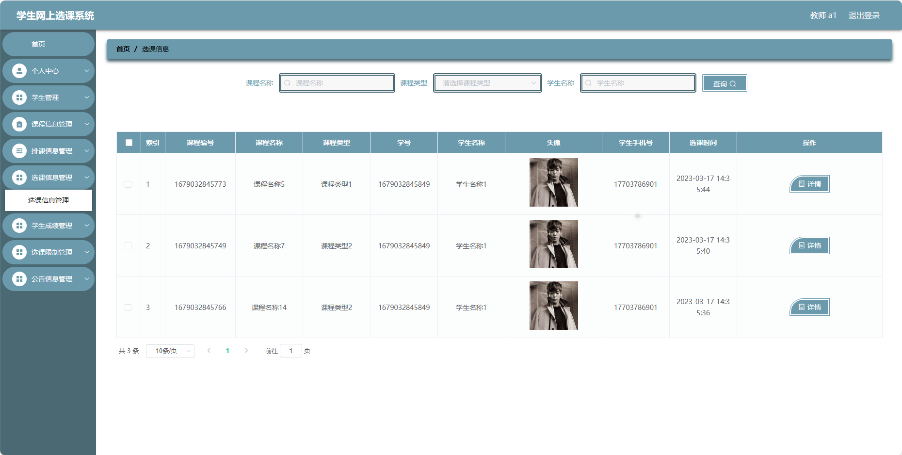
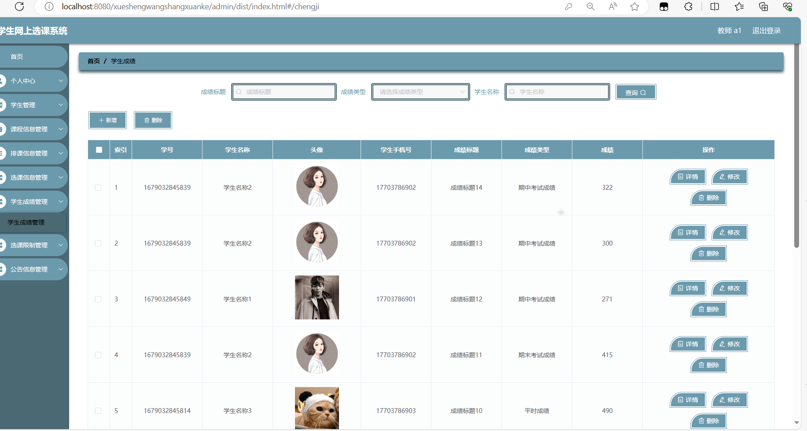
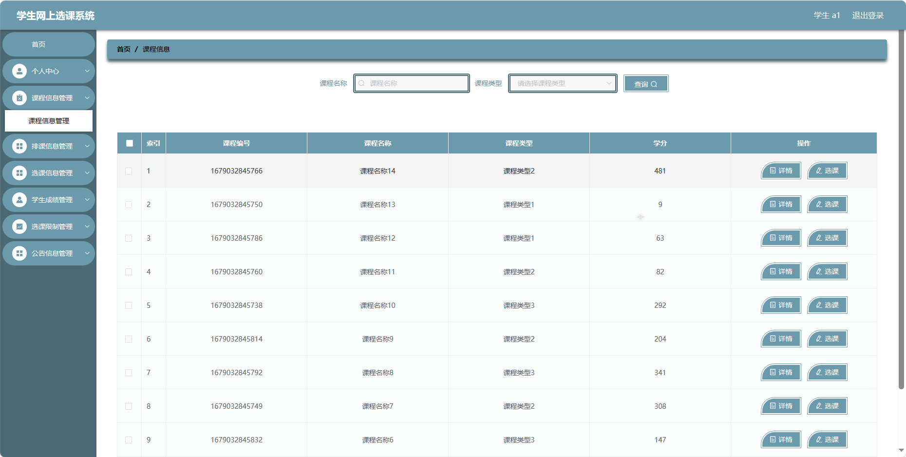

## 基于SpringBoot的学生网上选课系统(程序+报告)

###  获取sql数据库文件: 从戎源码网 (https://armycodes.com/) QQ: 386869957 QQ群: 377586148
###  所有系统地址: (https://github.com/YuLin-Coder/AllProjectCatalog) 
###  所有项目以及源代码本人均调试运行无问题 可支持远程安装部署调试、定制修改、代码讲解

## 项目介绍
基于SpringBoot的学生网上选课系统，系统包含三种角色：管理员、用户,教师，系统主要功能如下。

### 【管理员】:
- 首页：系统管理员后台的主页，。
- 个人中心：管理员个人信息管理，包括修改密码和查看个人信息。
- 管理员管理：添加、编辑、删除管理员账号。
- 教师管理：添加、编辑、删除教师账号。
- 学生管理：添加、编辑、删除学生账号。
- 课程信息管理：添加、编辑、删除课程信息。
- 排课信息管理：排课计划的管理，包括课程时间、地点等信息。
- 选课信息管理：学生选课信息的查看和管理。
- 学生成绩管理：录入和管理学生成绩。
- 基础数据管理：管理系统的基础数据，包括班级、成绩类型、第几节、课程类型、公告类型、周次、学期等。
- 选课限制管理：设置选课的限制条件。
- 公告信息管理：发布、编辑、删除系统公告。

### 【教师】:
- 首页：教师后台的主页。
- 个人中心：教师个人信息管理。
- 学生管理：查看和管理教学班学生信息。
- 课程信息管理：查看和管理所教授的课程信息。
- 排课信息管理：查看和管理排课计划。
- 选课信息管理：查看和管理学生选课信息。
- 学生成绩管理：录入和管理学生成绩。
- 选课限制管理：查看和管理选课的限制条件。
- 公告信息管理：发布、编辑、删除公告信息。

### 【学生】:
- 首页：学生后台的主页。
- 个人中心：修改密码和查看个人信息。
- 课程信息管理：查看可选课程和已选课程信息。
- 排课信息管理：查看课程的排课信息。
- 选课信息管理：选课和查看已选课程信息。
- 学生成绩管理：查看个人成绩。
- 选课限制管理：查看选课的限制条件。
- 公告信息管理：查看系统公告。

## 项目技术
- 编程语言：Java
- 数据库：MySQL
- 项目管理工具：Maven
- 前端技术：HTML、CSS、JavaScript、Jquery、Vue
- 后端技术：Spring、SpringMVC、MyBatis

## 运行环境
- JDK版本：JDK1.8及以上
- 开发工具：IDEA、Ecplise、Myecplise都可以
- 数据库: MySQL5.7及以上
- Maven：maven3.0及以上
- Node：14.14.0及以上

## 运行截图

